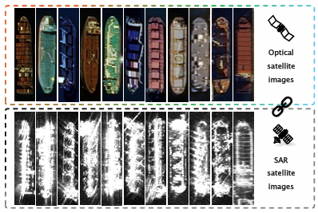
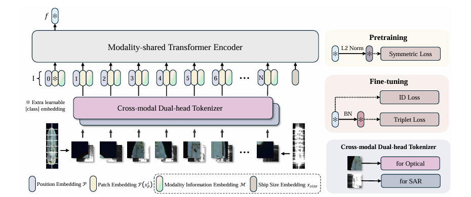

#  Cross-modal Ship Re-identification via Optical and SAR Imagery: A Novel Dataset and Method

### For CVPR paper review only.

## Dataset
We have placed some samples of our dataset in the `data` directory.\
The complete dataset will be made publicly available upon acceptance of the paper.



## Pipeline



## Requirements

### Installation

```bash
pip install -r requirements.txt
```

## Training
### Pretraining
We utilize 4 GPUs for pretraining
```bash
CUDA_VISIBLE_DEVICES=0,1,2,3 python -m torch.distributed.launch --nproc_per_node=4 --master_port 6667 train_pair.py --config_file configs/pretrian_transoss.yml MODEL.DIST_TRAIN True
```
### Fine-tune
Single GPU fine-tuning
```bash
python train.py --config_file configs/hoss_transoss.yml
```
Multiple GPUs fine-tuning
```bash
CUDA_VISIBLE_DEVICES=0,1 python -m torch.distributed.launch --nproc_per_node=2 --master_port 6667 train.py --config_file configs/hoss_transoss.yml MODEL.DIST_TRAIN True
```
## Evaluation
```bash
python test.py --config_file configs/hoss_transoss.yml MODEL.DEVICE_ID "('0')"  TEST.WEIGHT 'weights/HOSS_TransOSS.pth'
```

## Acknowledgement
Codebase from [TransReID](https://github.com/damo-cv/TransReID/tree/main), [reid-strong-baseline](https://github.com/michuanhaohao/reid-strong-baseline) , [pytorch-image-models](https://github.com/rwightman/pytorch-image-models).